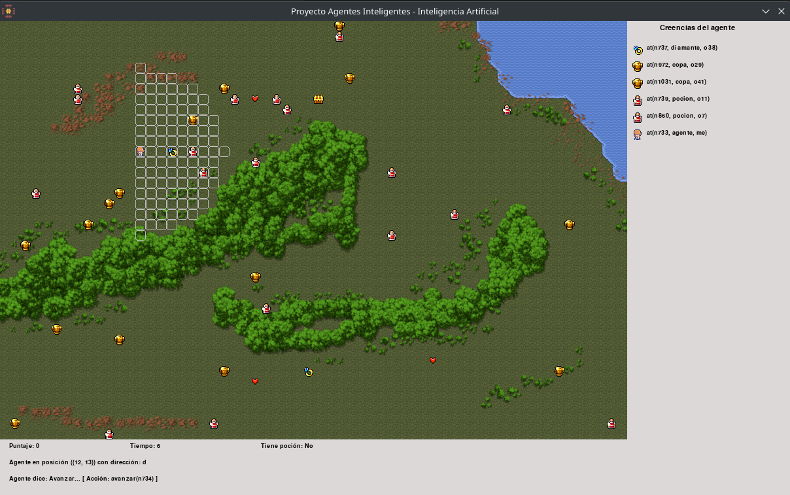

# Intelligent Agent for a VideoGame

## Project Summary

The general objective of the project is the design and implementation of an agent for controlling a video game character. Concepts such as the following were applied:

- Updating the agent's knowledge.
- Informed search, particularly the A* algorithm.

The agent perceives information from the environment and can perform actions that modify the state of the world. The agent has an internal state that allows it to encode its beliefs about the current state of the world. Based on these beliefs, it can make decisions and pursue its goals.

The game terrain is defined as a grid of 40 rows by 60 columns. Each grid node can have a movement cost and can contain a game entity (treasures, potions, clocks, etc.). The agent can move between adjacent nodes and collect objects to earn points and extend its lifespan.



## Agent Perception and Vision

The agent has a vision range of 8 nodes in the direction it is facing. It can collect potions to temporarily increase its vision range in all directions. The agent's goal is to collect as many treasures and clocks as possible to maximize its points and lifespan.

## Environmental Obstacles

The terrain may contain obstacles such as trees, rocks, or water zones, which have a high movement cost. The agent can move through these obstacles, but it will take more time.

## Communication between the Agent and the Game

The agent perceives the virtual world through the `run/4` predicate, updating its beliefs and deciding the next action to take.

To start the game, the `gameIA` binary (Linux) must be executed. SWI-Prolog (version 8.4.3 was used for game development) and Python must be installed. The `gameIA` executable will display the game interface and a console for debug messages.

## Agent Architecture

The agent has three main modules:

1. **Belief Update Module**: Updates the agent's beliefs about the world.
2. **Movement Planning Module**: Plans the best path to the objects to be collected.
3. **Decision Module**: Selects the next action to take according to the agent's strategy.

## Project Branches

- **main**: Contains the project's source code.
- **release**: Contains the source code along with the binaries for the Linux executable.
- **testing**: Used for testing and development.

## Installation

To install the project, Python and SWI-Prolog must be installed. Below are the steps to install them on Debian-based distributions:

```bash
sudo apt update

# Install Python
sudo apt install -y python3 python3-pip

# Install SWI-Prolog
sudo apt install -y swi-prolog

# Clone the repository (release branch)
git clone -b release https://github.com/lagosmanuel/treasure-hunt-ai.git
cd treasure-hunt-ai

# Run the binary
./gameIA
